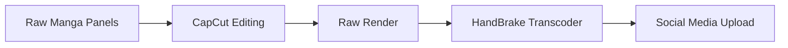
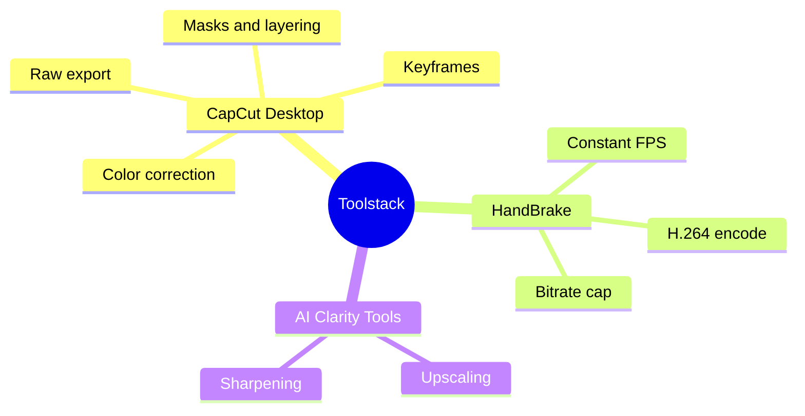
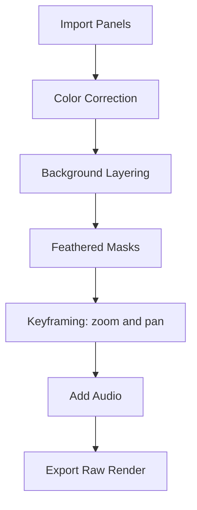
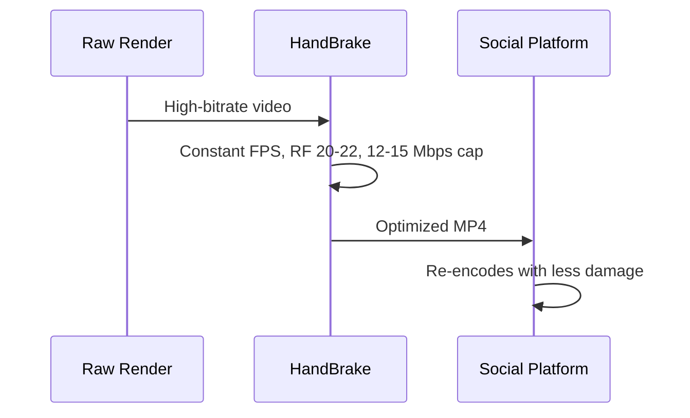
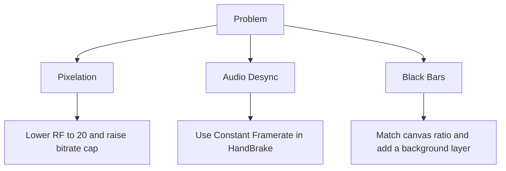

# 🎞️ Manga Motion Optimization Pipeline

A simple workflow for turning manga panels into motion videos with **CapCut**, then encoding them with **HandBrake** so they hold up against social media compression.

---

## 🖼️ Tutorial Posters


---

## 🔄 Pipeline



---

## 🧰 Toolstack



---

## ✂️ CapCut Editing Steps



1. **Color correction:** keep blacks deep and line art crisp.
2. **Background layering:** put a blurred or tinted backdrop behind each panel to avoid black bars.
3. **Feathered masks:** soften panel edges so they blend into the background.
4. **Keyframing:** animate scale and position for smooth pans and zooms.
5. **Export:** render a high-quality raw file.

---

## ⚙️ HandBrake Encoding

A ready-made preset is included: [`preset/handbrake_manga_motion.json`](preset/handbrake_manga_motion.json)

**To use it:** open HandBrake → **Presets** → **Import** → select the JSON file → load your raw render → **Start Encode**.



### Settings

| Setting | Value |
|---------|-------|
| Container | MP4 |
| Video Codec | H.264 |
| Framerate | Constant (match source, e.g. 30 or 60) |
| Quality (RF) | 20 to 22 |
| Bitrate Cap | 12 to 15 Mbps |
| Audio | AAC |

---

## 🛠️ Troubleshooting



---

## 📁 Repository Structure

```text
manga-motion-optimization-pipeline/
├── assets/
│   ├── Manga Motion Tutorial Poster.png
│   └── Manga Motion Tutorial Poster (1).png
├── preset/
│   └── handbrake_manga_motion.json
└── README.md
```

---

## 📜 Credits

- **Manga:** *Blood on the Tracks* by **Shuzo Oshimi**. All rights belong to the author and publishers.
- **Tools:** [CapCut](https://www.capcut.com/) and [HandBrake](https://handbrake.fr/).

This project is for educational purposes only and is not affiliated with the original author or publishers. Please support the official release.
