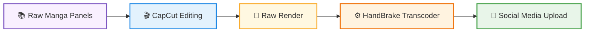
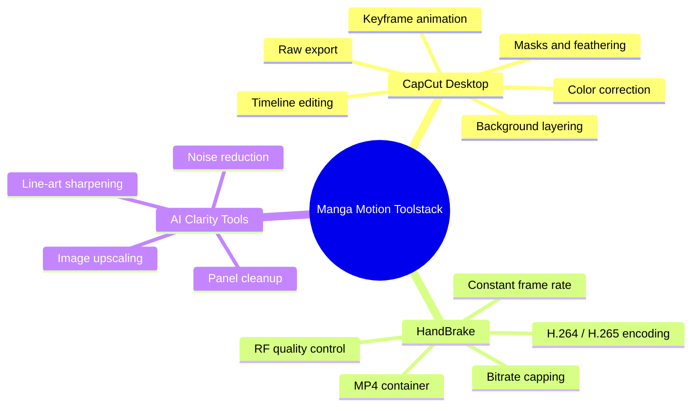
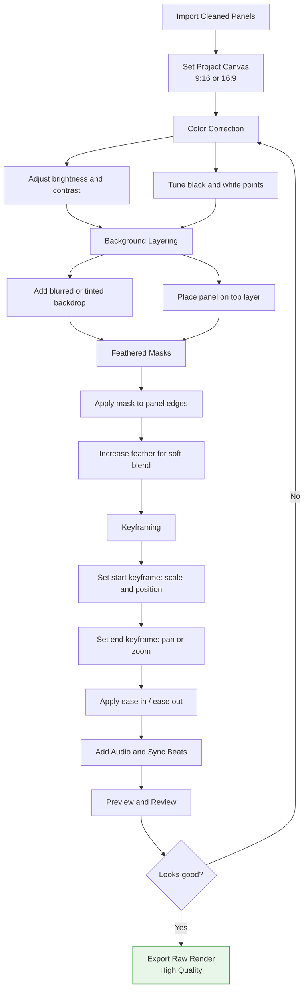
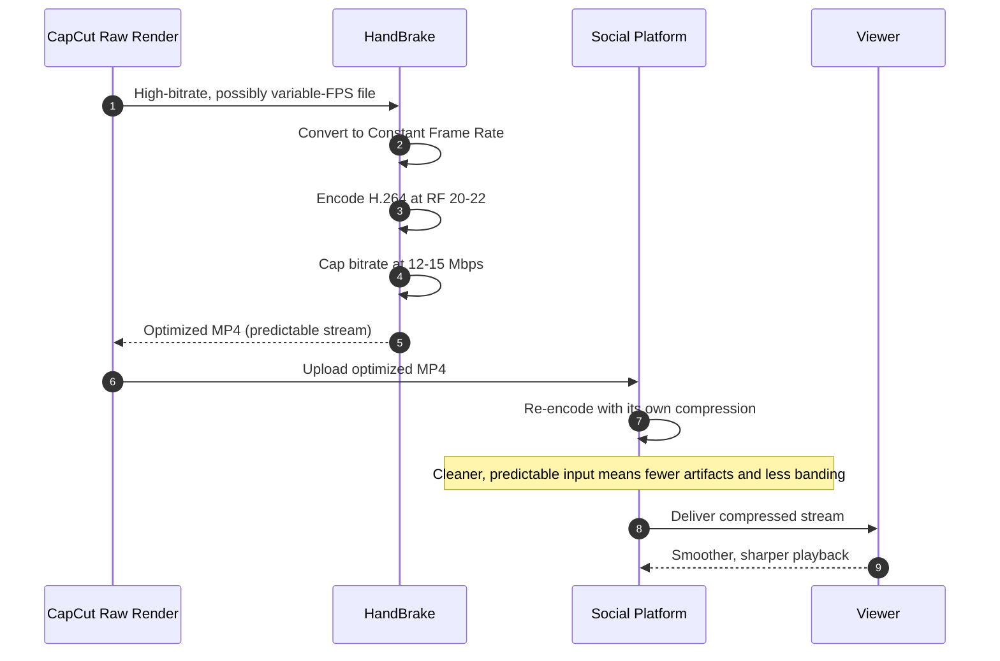
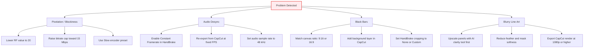

# 🎞️ Manga Motion Video Optimization & Editing Pipeline

> A reproducible workflow for turning static manga panels into polished motion videos, then encoding them so they survive social media recompression with minimal quality loss.


---

## 📑 Table of Contents

1. [Overview](#-overview)
2. [Tutorial Posters](#-tutorial-posters)
3. [Pipeline at a Glance](#-pipeline-at-a-glance)
4. [Toolstack](#-toolstack)
5. [CapCut Editing Workflow](#-capcut-editing-workflow)
6. [HandBrake Transcoding](#-handbrake-transcoding)
7. [How HandBrake Beats Platform Compression](#-how-handbrake-beats-platform-compression)
8. [HandBrake Settings Reference](#-handbrake-settings-reference)
9. [Troubleshooting](#-troubleshooting)
10. [Repository Structure](#-repository-structure)
11. [License & Credits](#-license--credits)

---

## 📖 Overview

Social platforms re-encode every upload. A video exported straight from an editor, especially one with a variable frame rate or an extreme bitrate, is often recompressed aggressively, producing pixelation, blurry line art, and audio drift.

This pipeline addresses that by:

- **Preparing** manga panels with clean, upscaled source images.
- **Editing** them in CapCut Desktop with color correction, layered backgrounds, feathered masks, and keyframed motion.
- **Exporting** a high-quality raw render.
- **Transcoding** it with HandBrake to a platform-friendly constant frame rate and a capped bitrate, so the platform's own re-encode has less to destroy.

---

## 🖼️ Tutorial Posters

Visual quick-reference guides for the workflow.


*Poster 1: Main workflow overview.*

.jpg)

*Poster 2: Supplementary guide and settings reference.*

---

## 🔄 Pipeline at a Glance



| Stage | Input | Output | Goal |
|-------|-------|--------|------|
| 1. Panel Prep | Scanned / raw manga pages | Clean, upscaled panel images | Maximum source clarity |
| 2. CapCut Editing | Panel images, audio | Animated timeline | Motion, depth, pacing |
| 3. Raw Render | CapCut project | High-bitrate master file | Lossless-feeling master |
| 4. HandBrake | Raw render | Optimized `.mp4` | Constant FPS, capped bitrate |
| 5. Upload | Optimized `.mp4` | Published video | Survive platform re-encode |

---

## 🧰 Toolstack



### Tool Notes

- **CapCut Desktop**: primary editor for motion, layering, and color work.
- **HandBrake**: open-source transcoder used for the final platform-safe encode.
- **AI clarity tools**: any upscaler or denoiser of your choice, applied to panels *before* import to give the editor the cleanest possible source.

---

## ✂️ CapCut Editing Workflow



### Step Summary

1. **Color correction**: normalize contrast so line art stays crisp and blacks stay deep.
2. **Background layering**: place each panel over a blurred or tinted backdrop to fill the frame without black bars.
3. **Feathered masks**: soften panel edges so they blend into the background instead of looking cut out.
4. **Keyframing**: animate scale and position for slow pans and zooms; use easing for natural movement.
5. **Export**: render a high-quality raw file at your project resolution and frame rate.

---

## ⚙️ HandBrake Transcoding

1. Open HandBrake and load the raw render from CapCut.
2. Select the **Fast 1080p30** preset (or a custom preset) as a starting point.
3. Apply the settings listed in the [reference table](#-handbrake-settings-reference).
4. Set the output filename and destination, then click **Start Encode**.
5. Verify playback (audio sync, sharpness, aspect ratio) before uploading.

---

## 🔬 How HandBrake Beats Platform Compression



**Why this works:** platforms re-encode everything. Handing them a constant-frame-rate, moderately bitrate-capped H.264 file gives their encoder predictable input, which tends to preserve line art and reduce blocking, rather than letting it struggle with an oversized or irregular source.

---

## 📊 HandBrake Settings Reference

| Parameter | Recommended Value | Notes |
|-----------|-------------------|-------|
| **Container** | MP4 | Widest platform compatibility |
| **Video Codec** | H.264 (x264) | Safest choice for social upload |
| **Framerate** | Match source (e.g., 30 or 60) | Select **Constant Framerate** (not Variable) |
| **Quality Mode** | Constant Quality | Use RF slider |
| **RF Value** | **20 to 22** | Lower = higher quality and larger file |
| **Encoder Preset** | Slow (or Medium) | Better compression efficiency |
| **Bitrate Cap** | **12 to 15 Mbps** | Set via Advanced options (e.g., `vbv-maxrate` / `vbv-bufsize`) |
| **Profile / Level** | High / 4.1 or 4.2 | Broad device compatibility |
| **Audio Codec** | AAC | 160 to 320 kbps, 48 kHz |
| **Web Optimized** | Enabled | Fast-start for streaming |

> **Tip:** if the output is larger than needed, raise RF by 1 (e.g., 21 to 22). If line art looks soft, lower it by 1.

---

## 🛠️ Troubleshooting



| Issue | Likely Cause | Fix |
|-------|--------------|-----|
| Pixelation | RF too high or bitrate cap too low | Lower RF to 20, raise cap toward 15 Mbps |
| Audio desync | Variable frame rate | Force Constant Framerate in HandBrake |
| Black bars | Canvas and aspect ratio mismatch | Match canvas ratio and add a background layer |
| Blurry line art | Low-resolution source panels | Upscale panels before import |

---

## 📁 Repository Structure

```text
manga-motion-pipeline/
├── assets/
│   ├── Manga_Motion_Tutorial_Poster.jpg
│   └── Manga_Motion_Tutorial_Poster_(1).jpg
├── docs/
│   ├── capcut-workflow.md
│   ├── handbrake-presets.md
│   └── troubleshooting.md
├── presets/
│   └── handbrake-social-media.json
├── samples/
│   ├── raw-render/
│   └── optimized-output/
├── CREDITS.md
├── LICENSE
└── README.md
```

---

## 📜 License & Credits

### Repository License

The documentation, workflow guides, and presets in this repository are released under the **MIT License**. See the [`LICENSE`](LICENSE) file for details.

### Manga Source Credit

The manga used in tutorials and examples is:

- **Title:** *Blood on the Tracks* (*Chi no Wadachi*)
- **Author / Artist:** **Shuzo Oshimi**

All rights to the manga, including its artwork, characters, and story, belong to the original creator and their respective publishers. Manga panels are **not** covered by this repository's MIT license.

### Disclaimer

This project is an educational and technical demonstration of video editing and encoding workflows. It is not affiliated with or endorsed by the original author or publishers. If you publish content based on copyrighted manga, you are responsible for ensuring you have the appropriate rights or permissions. Please support the official release.

### Tool Credits

- [CapCut](https://www.capcut.com/) for video editing
- [HandBrake](https://handbrake.fr/) for open-source video transcoding
- [Mermaid.js](https://mermaid.js.org/) for diagrams

---

<p align="center">Made with ❤️ for manga motion creators</p>
